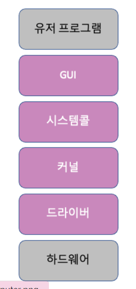

# 운영체제와 컴퓨터
하드웨어와 소프트웨어(유저 프로그램)를 관리하는 일꾼인 운영체제와 CPU, 메모리 등으로 이루어진 컴퓨터를 알아보자.
---
## 3.1.1 운영체제의 역할과 구조
---
### 운영체제의 역할
<운영체제의 역할>
1. CPU 스케줄링과 프로세스 관리: CPU 소유권을 어떤 프로세스에 할당할지, 프로세스의 생성과 삭제, 자원 할당 및 반환을 관리
2. 메모리 관리: 한정된 메모리를 어떤 프로세스에 얼만큼 할당해야 하는지 관리
3. 디스크 파일 관리: 디스크 파일을 어떠한 방법으로 보관할지 관리
4. I/O 디바이스 관리: I/O 디바이스들인 마우스, 키보드와 컴퓨터간에 데이터를 주고받는 것을 관리
---
### 운영체제의 구조

운영체제: GUI, 시스템콜, 커널, 드라이버
** GUI가 없고 CUI만 있는 리눅스 서버도 있음
##### GUI: 사용자가 전자장치와 상호작용할 수 있도록 하는 사용자 인터페이스의 한 형태, 단순 명령어 창이 아닌 아이콘을 마우스로 클릭하는 단순한 동작으로 컴퓨터와 상호 작용할 수 있도록 해준다.
##### 드라이버: 하드웨어를 제어하기 위한 소프트웨어
##### CUI: 그래픽이 아닌 명령어로 처리하는 인터페이스

### 시스템콜
운영체제가 커널에 접근하기 위한 인터페이스이며 유저 프로그램이 운영체제의 서비스를 받기 위해 커널 함수를 호출할 때 사용
<과정>
유저 프로그램이 I/O 요청으로 트랩을 발동 -> 올바른 I/O 요청인지 확인 -> 유저모드가 시스템콜을 통해 커널 모드로 변환되어 실행
##### I/O 요청: 입출력함수, 데이터베이스, 네트워크, 파일 접근 등에 관한 일
##### 드라이버: 하드웨어를 제어하기 위한 소프트웨어

<과정>
메모리/프로세스/스레드 -> 시스템콜 -> 커널 -> OS

<장점>
시스템콜은 하나의 추상화 계층이기 때문에 낮은 단계의 영역 처리(네트워크 통신이나 데이터베이스)에 대한 부분을 신경 쓰지 않고 프로그램 구현 가능

### modebit
- 시스템콜이 작동될 때 modebit을 참고해서 유저모드와 커널 모드를 구분
- modebit = 1(유저모드) OR modebit = 0(커널모드)의 값을 가지는 플래그 변수
ex> I/O 디바이스는 유저모드를 기반으로 작동할 경우 사용자가 공격자에게 공격을 받을 수 있음
커널 모드를 거쳐 운영체제를 작동한다고 해도 100% 막을 수는 없지만 운영체제를 통해야 막기가 쉬움
##### 유저모드: 유저가 접근할 수 있는 영역을 제한적으로 두며 컴퓨터 자원에 함부로 침범하지 못하는 모드
##### 커널모드: 모든 컴퓨터 자원에 접근할 수 있는 모드
##### 커널: 운영체제의 핵심 부분이자 시스템콜 인터페이스를 제공하며 보안, 메모리, 프로세스, 파일 시스템, I/O 디바이스, I/O 요청 관리 등 운영체제의 중추적인 역할을 함